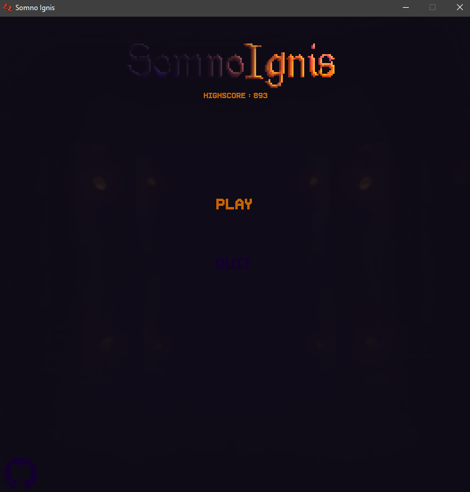
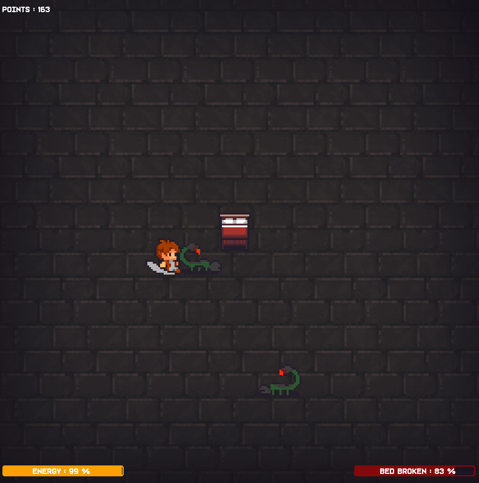

# Somno Ignis 🔥  

   

 

 

#### &emsp;**Somno Ignis** is a game where you incarn a fire spirit, that really wants to have some sleep.

#### &emsp;Unfortunately, this will be a little bit complicated as monsters will come nearby to bother him. 

#### &emsp;The game ends, when the bed is destroyed. 

 

 

 Good luck 😊

 

 

#

# How to install it ? 💤

 

 

### 
 **``pip install -r requirements.txt``** 

 

 

  &emsp; *Feel free to contribute to the project by adding whatever you want !*

 #

 
#
  
